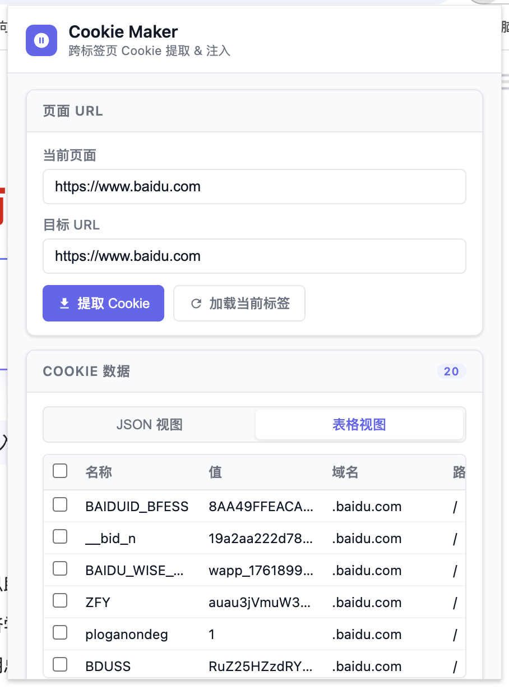
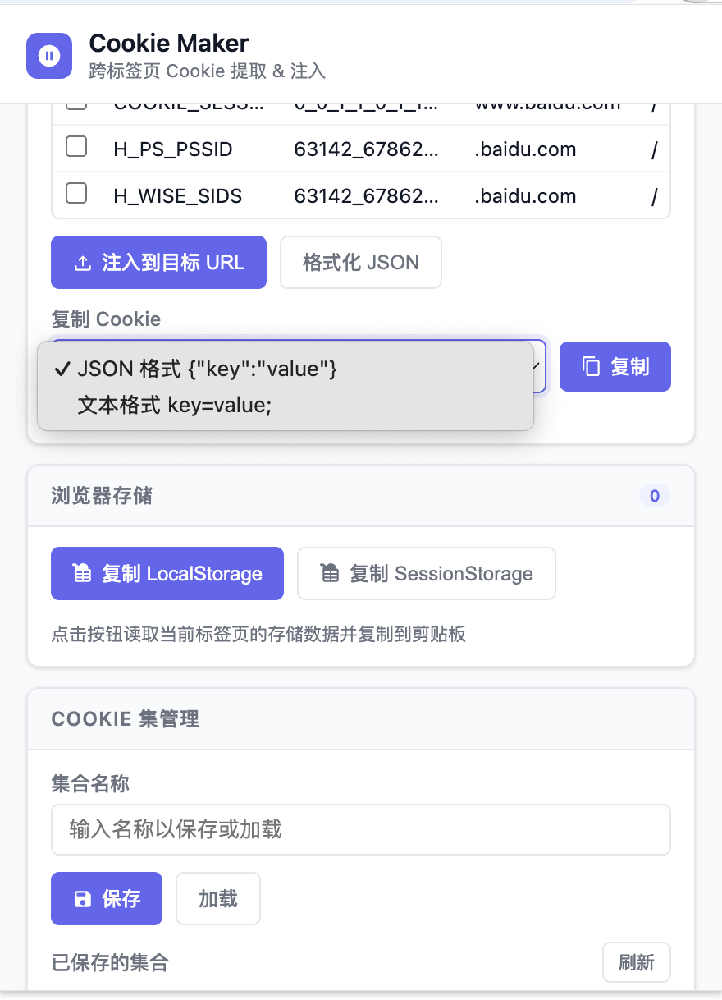

# Cookie Maker

一个用于跨标签页提取和注入 Cookie 的 Chrome 扩展工具，提供直观的 Cookie 管理界面、数据持久化功能，以及浏览器本地存储的读取与复制能力。

基于原作者项目：https://github.com/chunmingdeng/cookie-extension 界面优化与功能附加

## 界面预览图
  

## 功能特性

- 从当前页面提取 Cookie
- 向指定 URL 注入 Cookie
- 支持 JSON 视图和表格视图切换，表格视图支持勾选筛选
- 复制 Cookie 为 JSON 格式或文本格式（key=value;）
- 保存 / 加载 / 删除 Cookie 集到本地存储
- 自动缓存 Cookie 数据，切换标签页不丢失
- 一键复制当前页面的 LocalStorage 数据
- 一键复制当前页面的 SessionStorage 数据
- 存储数据读取后在面板内预览（key/value 表格）

## 安装方法

### 从源代码安装

1. 克隆或下载本项目代码到本地
2. 打开 Chrome 浏览器，访问 `chrome://extensions/`
3. 开启右上角的「开发者模式」
4. 点击「加载已解压的扩展程序」
5. 选择本项目的根目录
6. 扩展将被添加到 Chrome 浏览器中

## 使用说明

### Cookie 操作

1. 点击工具栏中的 Cookie Maker 图标打开面板，默认加载当前标签页 URL
2. **提取 Cookie**：点击「提取 Cookie」按钮，自动提取当前页面所有 Cookie
3. **注入 Cookie**：填写目标 URL，确认 Cookie 数据后点击「注入到目标 URL」
4. **复制 Cookie**：选择格式（JSON / 文本），点击「复制」按钮
   - 若 Cookie 数据为空，会给出提示
   - 表格视图下仅复制已勾选的条目
5. **格式化 JSON**：点击「格式化 JSON」使数据更易阅读

### 视图切换

- **JSON 视图**：显示原始 JSON，支持手动编辑
- **表格视图**：以表格展示，默认勾选 `access_token` 和 `refresh_token`

### LocalStorage / SessionStorage 复制

1. 切换到目标页面标签
2. 打开扩展面板，在「浏览器存储」卡片中点击对应按钮
3. 数据将以 JSON 格式复制到剪贴板，并在面板内展示预览
4. 注意：`chrome://` 等非 http/https 页面不支持此功能

### Cookie 集管理

- 输入集合名称后点击「保存」，将当前 Cookie 数据持久化
- 点击「加载」或列表中的「使用」按钮恢复已保存的数据
- 点击「删除」移除不需要的 Cookie 集

## 权限说明

| 权限 | 用途 |
|------|------|
| `cookies` | 读取和修改 Cookie |
| `activeTab` | 获取当前活动标签页信息 |
| `tabs` | 获取标签页 ID 用于注入脚本 |
| `storage` | 本地持久化 Cookie 集和缓存数据 |
| `scripting` | 在页面上下文中执行脚本以读取 Storage |
| `<all_urls>` | 允许操作所有网站的 Cookie |

## 注意事项

1. 请勿向不信任的网站注入 Cookie，操作前确认安全风险
2. 扩展仅在本地存储数据，不会上传到任何服务器
3. 清除浏览器数据可能导致已保存的 Cookie 集丢失

## 技术栈

- HTML5 / CSS3 / JavaScript
- Chrome Extension Manifest V3
- Chrome Extension API（cookies、scripting、storage、tabs）
